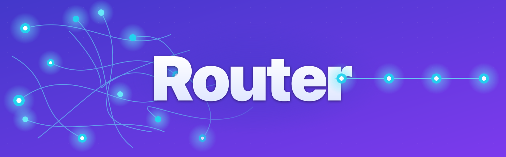
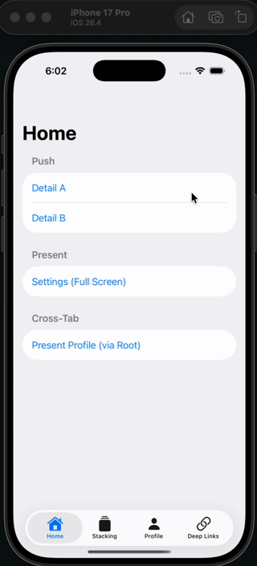

# Router



A lightweight SwiftUI navigation library that decouples routing logic from views. Built on `@Observable` for iOS 17+.



## Why Router?

Most SwiftUI routing libraries scope navigation to a single `NavigationStack`. Router goes further:

- **Any screen, from anywhere** — Define a single route enum wrapping per-feature routes, and any screen can be pushed, presented as a sheet, or shown as a full-screen cover from any tab. No passing routers between views, no manual wiring.
- **Hierarchical navigation** — Routers form a parent-child chain when modals are presented. `NavigationTarget` lets you direct actions to any point in the hierarchy — present on the root, push on the parent, or stack on the deepest child.
- **Modern Swift** — Built on `@Observable` and `@Environment`, not legacy `ObservableObject` and `@EnvironmentObject`.
- **Deep linking with tab support** — Handle deep links that switch tabs and navigate within them, using a single `.onDeepLink` modifier.

## Features

- **Type-safe routing** via `Routable` enums — each case maps to a view
- **Push, sheet, and full-screen cover** navigation with one generic `Router<Destination>`
- **NavigationSplitView support** — `SplitRouter` is a `Router` driving the detail column, with `sidebar` a full `Router` for the other, so both columns take the same verbs. It owns the split view's layout state and reports `isCollapsed` for compact width
- **Presentation without a stack** — `.routerPresentations(_:)` hosts router-driven modals on any view that already has navigation above it
- **NavigationTarget** — route to `.current`, `.parent`, `.root`, or `.deepest` router in a hierarchy
- **Cross-tab routing** — routers injected via `@Environment`, accessible from any child view
- **Sheet presentation options** — detents, drag indicator
- **Configurable dismiss buttons** — chosen per presentation: none, leading or trailing, and on pushed views within modals
- **Deep linking** — `.onDeepLink` modifier handles both external URLs and internal `openURL` calls
- **Automatic child router management** — modals get their own router, cleaned up on dismiss

## Requirements

- iOS 17+
- macOS 14+
- Swift 6.0+

## Installation

### Swift Package Manager

Add to your `Package.swift`:

```swift
dependencies: [
    .package(url: "https://github.com/alexookah/Router.git", from: "1.0.0")
]
```

Or in Xcode: File > Add Package Dependencies and paste the repository URL.

## Quick Start

### 1. Define your routes

```swift
import Router

enum HomeRoute: Routable {
    case home
    case detail(String)
    case settings

    func destination() -> some View {
        switch self {
        case .home: HomeView()
        case let .detail(id): DetailView(id: id)
        case .settings: SettingsView()
        }
    }
}
```

`destination()` is main-actor isolated, so it can build view models as freely as views. Conformances need no annotation in any language mode or default isolation.

### 2. Wrap your content in RoutingView

```swift
struct ContentView: View {
    @State var router = Router<HomeRoute>()

    var body: some View {
        RoutingView(router, root: .home)
    }
}
```

The closure form, `RoutingView(router) { $0.start(.home) }`, is there for roots that need more than a route.

### 3. Navigate from any child view

The router is automatically injected into the SwiftUI environment:

```swift
struct HomeView: View {
    @Environment(Router<HomeRoute>.self) var router

    var body: some View {
        Button("Show Detail") {
            router.push(route: .detail("123"))
        }

        Button("Open Settings Sheet") {
            router.presentSheet(
                route: .settings,
                options: .init(detents: [.medium, .large])
            )
        }

        Button("Open Settings Full Screen") {
            router.present(route: .settings)
        }
    }
}
```

## Navigation API

### Push

```swift
router.push(route: .detail("123"))
router.push(route: .detail("123"), target: .root) // push on root router
```

### Sheet

```swift
router.presentSheet(route: .settings)
router.presentSheet(
    route: .settings,
    navigation: .stack(dismiss: .visible),
    options: .init(detents: [.medium, .large], dragIndicator: .visible)
)
```

### Full-Screen Cover

> `present()` is iOS only. macOS has no full-screen cover equivalent — use `presentSheet(...)` on macOS.

```swift
router.present(route: .settings)
router.present(
    route: .settings,
    navigation: .stack(dismiss: .init(
        dismissButtonPosition: .left,
        showDismissButtonOnPush: true  // show X on views pushed within the modal
    ))
)

// A destination that builds its own NavigationStack / NavigationSplitView
router.present(route: .workspace, navigation: .own)
```

### Pop & Dismiss

```swift
router.pop()                // go back one
router.pop(last: 3)         // go back three
router.popToRoot()           // clear the stack

router.dismissChild()        // dismiss current sheet/fullScreenCover
router.dismiss()             // ask parent to dismiss this modal
router.dismissOrPopToRoot() // smart dismiss
router.dismissAllFromRoot()  // dismiss entire hierarchy
```

### Stack Manipulation

```swift
router.replaceStack(with: [.home, .detail("1"), .detail("2")])
router.replace(with: .detail("3"))          // swap the top
router.replace(last: 2, with: .detail("3")) // collapse the last two
router.lastPathIs(.detail("3")) // true

router.rootDestination        // what the stack was started with
router.currentDestination     // top of the path, else the root
router.previousDestination    // what pop() would reveal
router.currentDestinationIs(.detail("3"))
```

## Router Hierarchy

When you present a sheet or full-screen cover, Router automatically creates a **child router** for the modal. This forms a parent-child chain:

```
Root Router (tab)
  └── Child Router (sheet)
        └── Child Router (full-screen cover inside the sheet)
```

Each child has a reference to its parent. When a modal is dismissed, its child router is automatically cleaned up.

### NavigationTarget

`NavigationTarget` lets you direct navigation actions to any point in this hierarchy:

| Target | Description |
|--------|-------------|
| `.current` | This router (default) |
| `.parent` | The parent router |
| `.child` | The child router |
| `.root` | The top-most router in the chain |
| `.deepest` | The furthest child (leaf) in the chain |

```swift
// From inside a sheet, push on the parent's navigation stack
router.push(route: .detail("1"), target: .parent)

// From anywhere, present on the root router
router.presentSheet(route: .settings, target: .root)

// Stack a modal on top of an existing modal
router.presentSheet(route: .profile, target: .deepest)
```

This enables cross-tab routing and modal stacking without passing routers around manually.

## NavigationSplitView

A `SplitRouter` *is* a `Router` — the one driving the detail column — that gained a sidebar:

```swift
enum AppRoute: Routable { ... }

let appRouter = SplitRouter<AppRoute>()

SplitRoutingView(appRouter, sidebar: .folders, detail: .overview)
```

So every surface uses `Router`'s own API, with no extra names to learn:

```swift
appRouter.push(route: .article(id))            // detail column
appRouter.presentSheet(route: .settings)       // modal over the screen
appRouter.present(route: .editor)              // full-screen cover (iOS)
appRouter.dismissChild()
appRouter.path                                 // the detail stack

appRouter.sidebar.push(route: .folder(id))     // sidebar column
appRouter.sidebar.presentSheet(route: .filters)
appRouter.sidebar.replaceStack(with: [.folder(a), .folder(b)])
appRouter.sidebar.pop()                        // …pop (clamped)

appRouter.popAllToRoot()                       // both columns at once
```

Both columns are full routers and take the same verbs — there is one navigation vocabulary, `Router`'s. `sidebar` is the sidebar's; `detail` names the split router itself, so `appRouter.detail.push(route:)` is `appRouter.push(route:)`. `sidebarPath` remains as plain array access to `sidebar.path`, for reading and binding.

A view *inside* a column can also reach its own column's router without knowing which one it is — its `RoutingView` puts it in the environment:

```swift
struct FoldersView: View {
    @Environment(Router<AppRoute>.self) private var columnRouter

    var body: some View {
        Button("Filters") { columnRouter.presentSheet(route: .filters) }
    }
}
```

Both columns share one `Destination`, so any route can go to either.

A column's view *is* its route's `ViewType`, so a route value is all a root can be — there's one initializer, no closure form. Pick a root conditionally with an expression (`sidebar: hasFolders ? .folders : .empty`), and let the route's own destination read live state for anything dynamic.

### Compact width: the columns become one stack

At compact width SwiftUI collapses the split view into a *single* stack, formed by concatenating the columns:

```
sidebar root  →  detail root  →  detail path…
```

Two consequences worth knowing before you ship an iPhone build:

- **The detail root is a real screen.** `appRouter.push(route:)` from the sidebar lands *two* levels deep, so going back reaches the detail root rather than the sidebar. On iPad you never notice, because the detail root is permanently on screen in the other column.
- **`horizontalSizeClass` is the wrong tool inside a column.** A column reports its own width, so a narrow sidebar on a full-size iPad reads as `.compact` while both panes are visible.

`SplitRoutingView` sits outside the split view, so it can read the window's size class and publish it as `isCollapsed`. Branch on that when a push should read as one level to the user:

```swift
if appRouter.isCollapsed {
    appRouter.sidebar.push(route: .article(id))   // one stack: stays one level
} else {
    appRouter.push(route: .article(id))           // detail column
}
```

### Layout state

`isCollapsed`, `preferredCompactColumn` and `columnVisibility` live on the router, not as `@State` alongside the view, so layout can be driven from wherever the router reaches — a coordinator, a deep link handler — without threading bindings:

```swift
appRouter.preferredCompactColumn = .detail   // reveal the detail pane
appRouter.columnVisibility = .all
```

They default to SwiftUI's own `.sidebar` and `.automatic`, and SwiftUI writes back to both as the user navigates. One gotcha worth knowing: a *bound* `.automatic` is not the same as an unbound `NavigationSplitView` — on iPad it starts the sidebar hidden. Set `columnVisibility = .all` when you want both columns from launch.

Set `preferredCompactColumn` explicitly alongside navigation that should be visible: SwiftUI does not reliably follow a column's own selection when that column has its own `NavigationStack`.

### Modals over the whole screen

Present them on the split router. Two things make that work as well as a dedicated surface would, both measured rather than assumed:

- A collapsed split view keeps **both** columns in the hierarchy, so the presentation shows whichever pane is visible.
- A full-screen cover presented from a column covers the **whole window**, not just that column.

Only one modal is on screen at a time regardless: UIKit presents one per view-controller chain, so a sheet raised while the other column already has one showing will not appear. Stack them with `target: .deepest`, which presents on the child router of the one already up.

> **Sidebar rows: prefer `List(selection:)`.** In compact width (iPhone, iPad Split View), `NavigationSplitView` only switches to the detail pane automatically when navigation comes from a `List` selection change. Plain `Button` rows swap state without moving the user, which reads as "nothing happened" on iPhone — if you use them, drive the `preferredCompactColumn` binding yourself. A clean pattern that keeps your coordinator in charge is a custom binding:
>
> ```swift
> List(selection: Binding(
>     get: { coordinator.selection },
>     set: { coordinator.select($0) }   // choreography lives in one place
> )) { ... }
> ```
>
> Also note a column reports **its own** width: an iPad sidebar is narrow enough to report `horizontalSizeClass == .compact` while the split view is showing both panes. Read the size class outside the split view if you need the window's.


### Presenting from containers without a stack

`RoutingView` bundles a `NavigationStack` with modal hosting. When the presenting view already sits inside navigation — a subview deep in a column, a `TabView`, a hand-rolled split view — attach just the modal hosting:

```swift
struct PartDetailView: View {
    @State private var photoRouter = Router<PhotoRoute>()

    var body: some View {
        content
            .routerPresentations(photoRouter)   // no extra NavigationStack
            .environment(photoRouter)
    }
}

photoRouter.present(route: .camera(partId: id))
```

### Destinations that own their navigation

Presented routes are normally wrapped in a `RoutingView` so they can push and present further. If a destination *is* a navigation container (a `NavigationSplitView`, or a view that builds its own `NavigationStack`), present it with `navigation: .own` and it goes up as-is:

```swift
router.present(route: .fullScreenWorkspace, navigation: .own)
router.presentSheet(route: .taskTeam, navigation: .own)
```

It's a property of the presentation, not of the route type, so the same route can be wrapped in one place and bare in another. `replace` keeps the flag it was opened with — swap only between routes that agree on it.

Sheets inherit the presenting view's environment, so inside `.own` content `@Environment(Router<AppRoute>.self)` is the *presenting* router. `dismissChild()` on it is the router-side close, alongside `@Environment(\.dismiss)`; `dismiss()` there would ask the presenter's own parent.

This is also the shape for presenting a whole split screen: the destination owns a `SplitRouter` and composes the `SplitRoutingView` itself. That wrapper view is not boilerplate — it is the *session scope*: the one place above both columns where objects the columns share can be created, injected, and torn down with the presentation.

```swift
struct WorkspaceView: View {
    @State private var router = SplitRouter<AppRoute>()
    @State private var session = WorkspaceSession()

    var body: some View {
        SplitRoutingView(router, sidebar: .folders, detail: .overview)
            .environment(session)   // visible to both columns
    }
}

appRouter.present(route: .workspace, navigation: .own)
```

## Cross-Tab Routing

Use a single route enum wrapping per-feature routes. Each tab gets its own router, and any view can navigate across tabs:

```swift
// Define a top-level route
enum AppRoute: Routable {
    case home(HomeRoute)
    case profile(ProfileRoute)
    case search(SearchRoute)

    func destination() -> some View {
        switch self {
        case let .home(route): route.destination()
        case let .profile(route): route.destination()
        case let .search(route): route.destination()
        }
    }
}

typealias AppRouter = Router<AppRoute>

// One router per tab
struct MainTabView: View {
    @State var homeRouter = AppRouter()
    @State var profileRouter = AppRouter()

    var body: some View {
        TabView {
            Tab("Home", systemImage: "house") {
                RoutingView(homeRouter, root: .home(.home))
            }
            Tab("Profile", systemImage: "person") {
                RoutingView(profileRouter, root: .profile(.profile))
            }
        }
    }
}

// From any child view — present a profile screen from the home tab
struct HomeView: View {
    @Environment(AppRouter.self) var router

    var body: some View {
        Button("View Profile") {
            router.presentSheet(route: .profile(.profile), target: .root)
        }
    }
}
```

## Deep Linking

The `.onDeepLink` modifier handles URLs from both external sources (Safari, push notifications) and internal `openURL` calls. Return `true` if the URL was handled, `false` to pass it to the system.

```swift
TabView(selection: $selectedTab) {
    // tabs...
}
.onDeepLink { url in
    guard url.scheme == "myapp",
          let host = url.host else { return false }

    switch host {
    case "home":
        selectedTab = .home
        if let id = url.pathComponents.dropFirst().first {
            homeRouter.push(route: .home(.detail(id)))
        }
    case "profile":
        selectedTab = .profile
    default:
        return false
    }
    return true
}
```

## Dismiss Button Options

The presenter chooses the dismiss button for the modal it shows, so pass the
options when presenting. `nil` is no button; `.visible` is a leading one:

```swift
// Full-screen cover with dismiss button on the left (.visible is the default)
router.present(route: .settings)

// Sheet with a dismiss button (sheets default to nil — they swipe away)
router.presentSheet(route: .settings, navigation: .stack(dismiss: .visible))

// Dismiss button on the right
router.present(
    route: .settings,
    navigation: .stack(dismiss: .init(dismissButtonPosition: .right))
)

// Cover without a button — the content closes itself
router.present(route: .settings, navigation: .stack(dismiss: nil))
```

The options describe a button that is shown — its position, and whether pushed
views inside the modal get it too. There is no hidden flag, so "no button" has
one spelling and cannot disagree with on-push settings.

`navigation: .own` carries no dismiss options at all — a destination that owns
its navigation owns its chrome, and closes itself with `@Environment(\.dismiss)`.

## Migration from 1.x

1. Remove `providesOwnNavigation` from your `Routable` conformances. Where a route needed its own navigation container, pass `navigation: .own` at the `present`/`presentSheet` call site.
2. `presentSheet(route:dismissOptions:)` and `present(route:dismissOptions:)` became `navigation: .stack(dismiss:)`. `.hidden` is now `nil`; `.visible` is unchanged. Drop `showDismissButton:` from any `DismissButtonPresentationOptions.init` — a button you construct is shown.
3. `replaceLast(with:)` is `replace(with:)`, and a replace of a presented modal now swaps its content in place instead of re-presenting.
4. `RoutingView(router) { $0.start(.home) }` still compiles. `RoutingView(router, root: .home)` is the shorter form, and `dismissOptions:` is only needed when you build a `RoutingView` for presented content yourself.
5. `@MainActor` annotations on `destination()` or `@MainActor Routable` conformances can be removed; the requirement is isolated now.

## Example App

The `ExampleRouterDemo` Xcode project demonstrates all features with a 5-tab app:

- **Home** — push navigation, full-screen covers, cross-tab routing
- **Stacking** — present sheets on top of sheets using `target: .deepest`, dismiss all with `dismissAllFromRoot()`
- **Profile** — full-screen cover with dismiss button positioning
- **Split** — `SplitRoutingView` with a button per `SplitRouter` API: column pushes, sheets and covers from either column, and `popAllToRoot()`. Run it on iPad and on iPhone to see that a column's presentations work in both layouts
- **Deep Links** — tappable deep link URLs that trigger tab switching and navigation

To run it, open `ExampleRouterDemo/ExampleRouterDemo.xcodeproj` — the Router package is already included as a local dependency.

## License

MIT

---

If you find Router useful, give it a :star: — it helps others discover the project.
